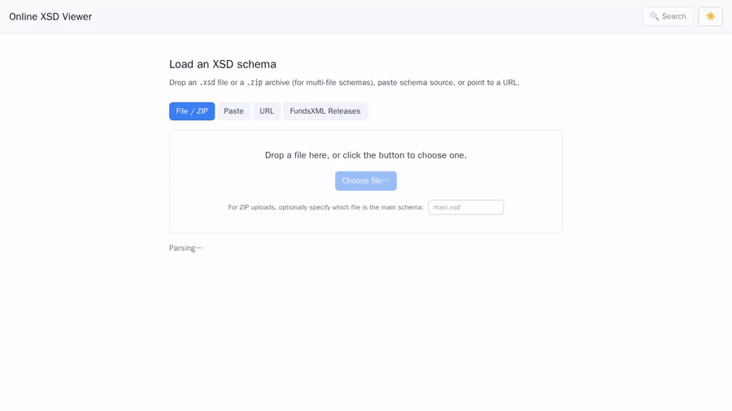
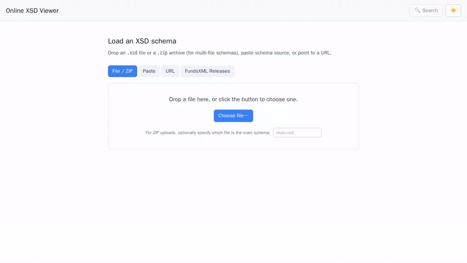

# Online XSD Viewer

**Read, understand and share XML Schemas in your browser — no install, no
account, no upload that sticks around.**

Open <https://www.xsd-viewer.online> and drop in an `.xsd` file. You get a
tree, an interactive XMLSpy-style diagram and the syntax-highlighted source
side by side, all linked to the same selection.

## What you can do with it

- **See the whole schema at a glance.** The diagram lays elements out the way
  XMLSpy and Oxygen do — sequences, choices, cardinalities, expand/collapse,
  pan & zoom.
- **Three synchronised views.** Pick a node in the *Tree*, jump to the
  *Diagram*, or switch to *Text* and land on the same line in the source —
  the selection follows you across all three.
- **Everything the schema actually says.** Elements, attributes, simple and
  complex types, facets, restrictions, `xs:annotation` / `xs:documentation`,
  `xs:appinfo`, XML comments, and the original source file and line number
  for every declaration.
- **Multi-file schemas.** Drop a single `.xsd`, or a `.zip` containing the
  main schema plus its `xs:import` / `xs:include` / `xs:redefine` targets —
  the viewer resolves them and treats the bundle as one model.
- **Load from a URL.** Paste any public `http(s)` link to an XSD and the
  viewer fetches it (with private-IP and SSRF protections enabled).
- **Fast search.** Press <kbd>Ctrl</kbd>/<kbd>⌘</kbd> + <kbd>K</kbd> and
  start typing — full-text across element, type and attribute names,
  including documentation.
- **Navigate like an IDE.** Breadcrumbs, *Find Usages*, deep-linkable URLs
  (every node has its own hash), and a type-filter to narrow the tree.
- **Export.** Diagram as PNG or SVG, the whole schema as standalone HTML
  documentation, or pretty-printed XML.
- **Light, Dark, Desktop, Tablet, Mobile.** The UI follows
  `prefers-color-scheme` and reflows down to phone widths.
- **Handles real-world schemas.** Tested up to ~50 MB with virtual scrolling
  and lazy diagram rendering.

## Load FundsXML releases with one click

If you work with [FundsXML](https://fundsxml.org/), the viewer pulls the
official releases straight from the
[`fundsxml/schema`](https://github.com/fundsxml/schema/releases) GitHub repo.
Open the *Load schema* screen, pick the **FundsXML Releases** tab, and click
the version you want — every release back to the early 4.x line is one click
away, including its `xmldsig-core-schema.xsd` companion.

## Your data stays with you

- **Nothing is stored.** Uploads are parsed in memory and dropped from a
  short-lived cache. There is no database, no file persistence, no analytics
  on your schemas.
- **No account, no login.** Just open the site and drop a file.
- **You can run it yourself.** The whole app is a single Docker container —
  see [docs/TECHNICAL.md](docs/TECHNICAL.md) for self-hosting.

## No warranty

This tool is offered free of charge and **without any warranty**. The
visualisation is a best-effort rendering of your schema; it is not a
certified validator. Do **not** rely on it as the single source of truth for
regulatory, contractual or production decisions — always verify against the
authoritative schema and an established validator. Use is at your own risk.

## Found a bug? Missing a feature?

Please open an issue on GitHub — bug reports, reproduction steps and feature
requests are all welcome:

➡️ <https://github.com/karlkauc/online-xsd-viewer/issues>

## Technical details, self-hosting & development

Configuration, hardening, env vars, Cloud Run deployment, the architecture
diagram and the dev-setup steps live in
**[docs/TECHNICAL.md](docs/TECHNICAL.md)**.

## Author

Built and maintained by **Karl Kauc** —
[github.com/karlkauc](https://github.com/karlkauc).

## License

MIT — see [LICENSE](LICENSE) and [NOTICE](NOTICE).
